# 🌟 AWS Data Lake Pipeline — Amazon Dataset

  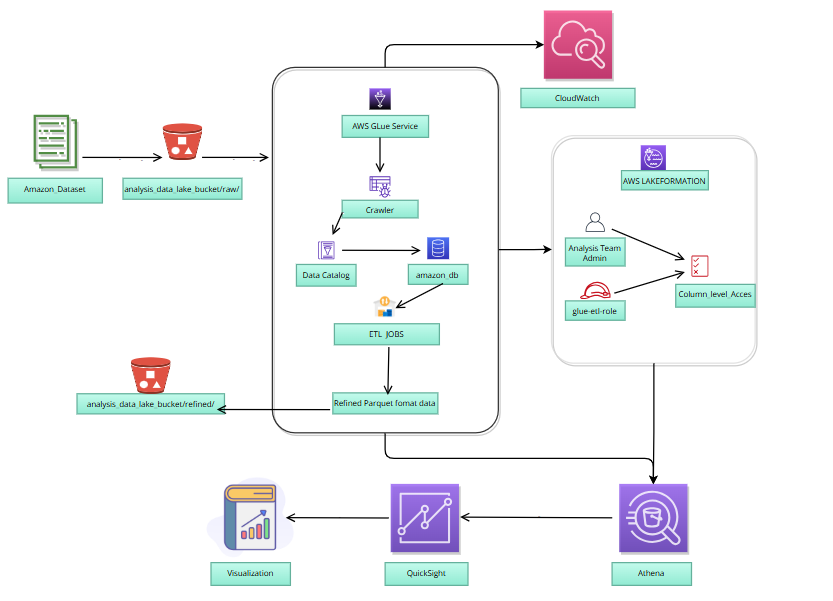

---

## 📘 Table of Contents

- [Project Overview](#project-overview)
- [Architecture Diagram](#architecture-diagram)
- [Step-by-Step Implementation](#step-by-step-implementation)
  - [1. Preparation and Setup](#1-preparation-and-setup)
  - [2. Data Ingestion](#2-data-ingestion)
  - [3. Cataloging Data](#3-cataloging-data)
  - [4. ETL (Transform)](#4-etl-transform)
  - [5. Querying Data (Athena)](#5-querying-data-athena)
  - [6. Security & Governance](#6-security--governance)
  - [7. Visualization & Insights](#7-visualization--insights)
  - [8. Testing, Monitoring & Optimization](#8-testing-monitoring--optimization)
- [Project Outcomes](#project-outcomes)
- [Author](#author)

---

## Project Overview

- End-to-end AWS Data Lake implementation for an amazon.csv dataset.
- Primary services used: S3, AWS Glue, Amazon Athena, Lake Formation, CloudWatch, QuickSight.
- Goal: ingest, catalog, transform, query, secure, monitor, and visualize product data (e.g., category, rating).
- Core resources referenced:
  - S3 bucket: `analysis-data-lake-bucket-20250825`
  - Glue database: `amazon_db`
  - Glue table: `amazon_csv` (and `amazon_refined` for transformed data)
  - IAM role: `glue-etl-role` (ARN: `arn:aws:iam::747757438809:role/glue-etl-role`)

---

## Architecture Diagram

- Data flow (high level): External Data Source → Amazon S3 → AWS Glue → Glue Jobs → Amazon Athena → Lake Formation & CloudWatch
- Key storage and structure in S3: `raw/`, `refined/`, and `athena-results/` folders under the analysis bucket.

---

## Step-by-Step Implementation

### 1. Preparation and Setup

- Signed into the AWS Console and selected region `us-east-1`.
- Created S3 bucket `analysis-data-lake-bucket-20250825` with:
  - Block public access enabled.
  - Server-side encryption (SSE-S3) enabled.
  - Versioning enabled.
  - (Optional) Lifecycle rule planned for future optimization.
- Created IAM role `glue-etl-role` with policies:
  - `AWSGlueServiceRole` for Glue permissions.
  - Custom S3 policy scoped to the analysis bucket.
  - `AmazonAthenaFullAccess` for query execution.
  - Trust policy for `glue.amazonaws.com` and `lakeformation.amazonaws.com`.
- (Optional) Configured VPC endpoints for S3 and Glue to keep traffic private.
- Outcome: secure infrastructure foundation established.

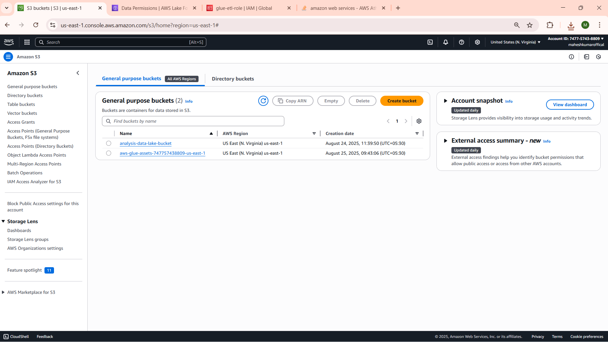
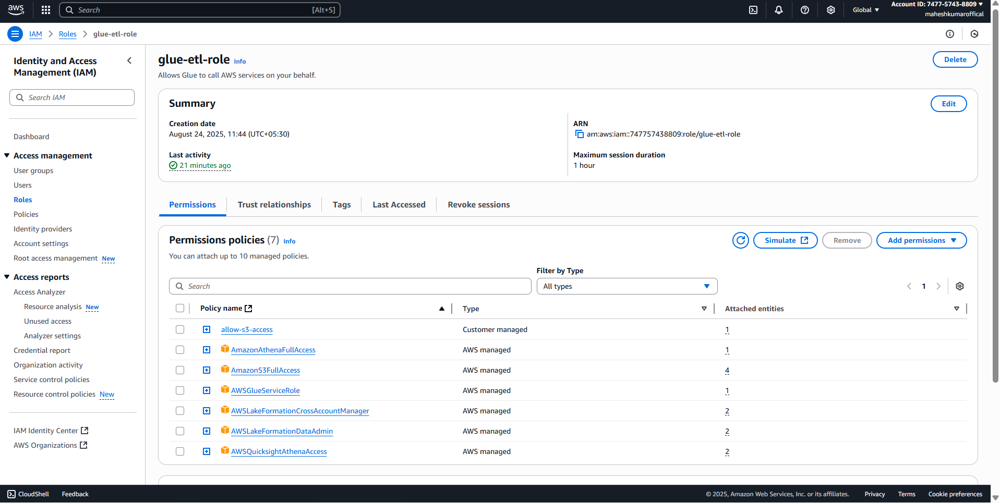
### 2. Data Ingestion

- Prepared `amazon.csv` containing product fields (for example: category, rating).
- Uploaded file to `s3://analysis-data-lake-bucket-20250825/raw/amazon/`.
- Organized S3 using `raw/`, `refined/`, and `athena-results/` prefixes for lifecycle and query separation.
- Outcome: raw data stored durably in S3.

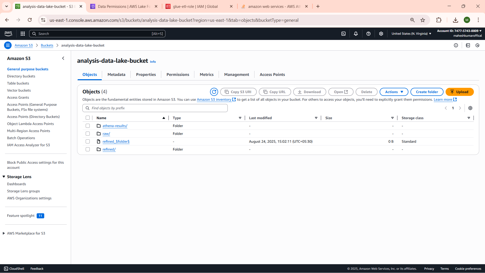

### 3. Cataloging Data

- Created Glue database `amazon_db` in the Glue console.
- Configured and ran a Glue crawler `amazon-crawler` to scan `s3://analysis-data-lake-bucket-20250825/raw/amazon/`.
  - Crawler used the `glue-etl-role` and targeted `amazon_db`.
- Result: crawler generated table `amazon_csv` with an inferred schema.
- Troubleshooting: resolved `TABLE_NOT_FOUND` by re-running the crawler after verifying S3 data placement.
- Outcome: metadata cataloged and queryable.

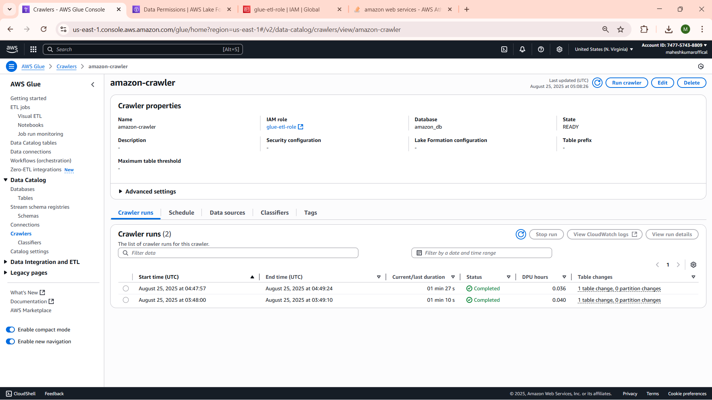

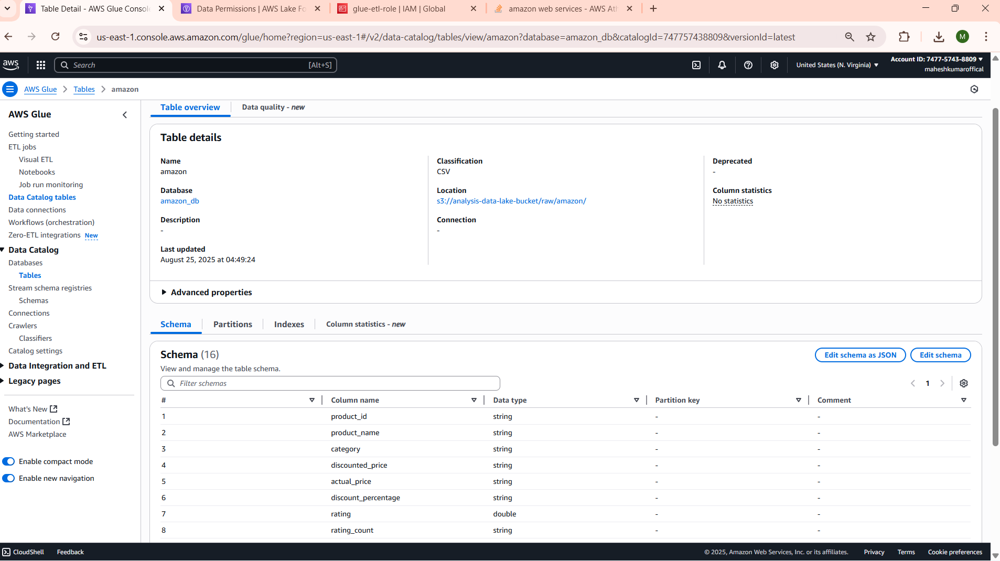

### 4. ETL (Transform)

- Created Glue job `amazon-etl-job` with:
  - IAM role: `glue-etl-role`.
  - Type: Spark (PySpark).
  - Workers: 2 DPUs.
  - Output: `s3://analysis-data-lake-bucket-20250825/refined/amazon-parquet/` (Parquet format).
- Example PySpark script used in the job (high-level):
  - Read data from Glue catalog (`amazon_db.amazon_csv`).
  - Drop rows missing `rating`.
  - Cast `discount_percentage` to float.
  - Aggregate average `rating` by `category` (result `avg_rating`).
  - Write output partitioned by `category` in Parquet.
- Created an additional crawler for the refined Parquet path to generate `amazon_refined`.
- Outcome: transformed data optimized as Parquet with aggregated insights.

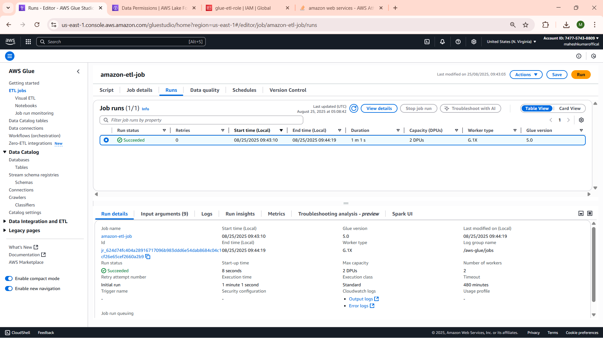

### 5. Querying Data (Athena)

- Created Athena workgroup `amazon-workgroup` with results stored at `s3://analysis-data-lake-bucket-20250825/athena-results/` and execution role set to the Glue ETL role.
- Example queries executed:
  - Raw: `SELECT category, rating FROM amazon_csv WHERE rating > 4 ORDER BY rating DESC LIMIT 10;`
  - Refined: `SELECT category, avg_rating FROM amazon_refined ORDER BY avg_rating DESC;`
- Troubleshooting: `TABLE_NOT_FOUND` fixed by re-running the crawler for the target path.
- Outcome: ad-hoc and aggregated queries available.

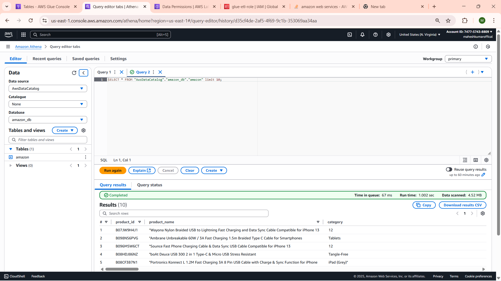

### 6. Security & Governance

- Enabled AWS Lake Formation and registered the S3 data location.
- Granted admin permissions to `admin-analysis-team`.
- Registered the S3 path to the Glue role and enabled Lake Formation mode.
- Applied fine-grained permissions:
  - `glue-etl-role`: Describe / Alter on `amazon_db`, Select / Describe on `amazon_csv` (columns `category`, `rating`), and S3 data access as needed.
  - Revoked default `IAMAllowedPrincipals` where appropriate.
- Outcome: fine-grained access control and governance in place.

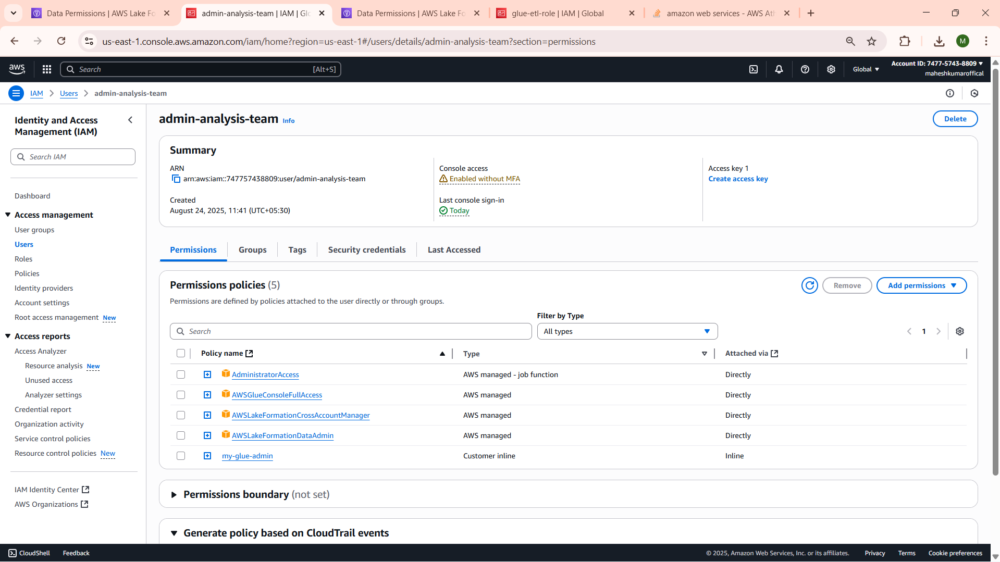
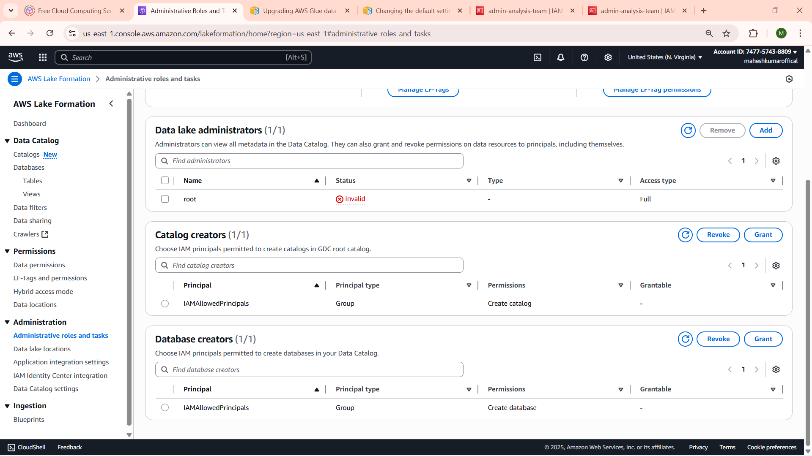
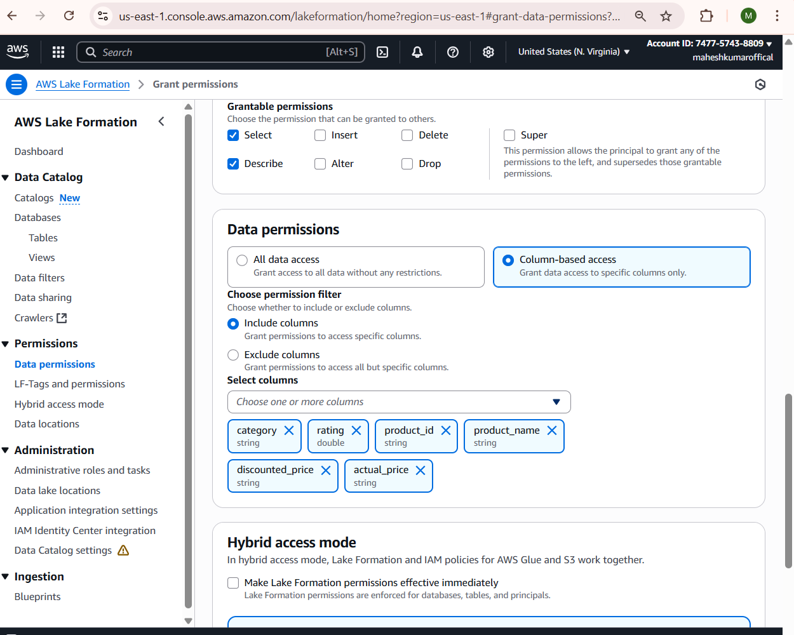
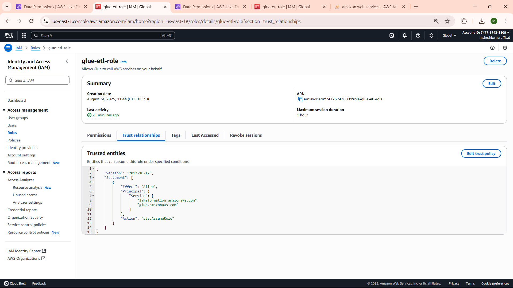

### 7. Visualization & Insights

- Signed up for Amazon QuickSight (trial) and granted it access to S3 and Athena.
- Created a QuickSight dataset from `amazon_db.amazon_refined`.
- Built and published a dashboard with visuals such as a bar chart of `category` vs `avg_rating`.
- Outcome: interactive visual insights and dashboards shared with stakeholders.

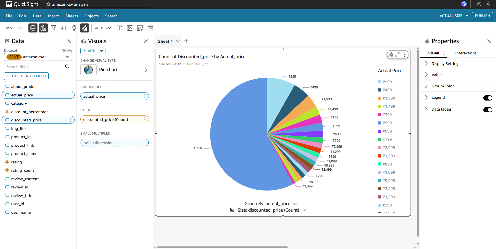
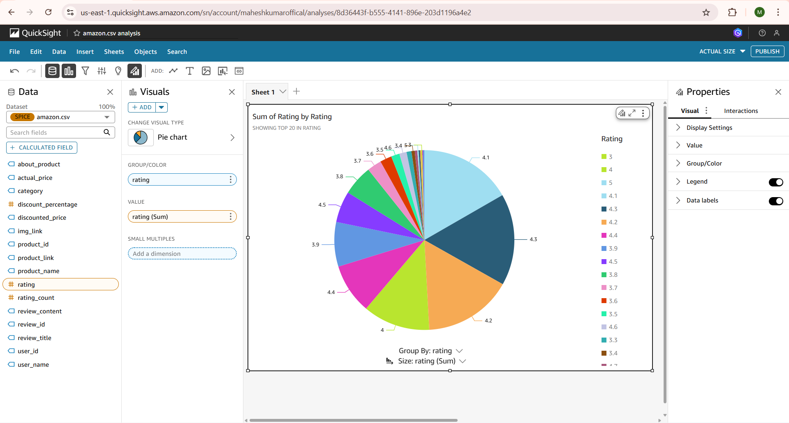

### 8. Testing, Monitoring & Optimization

- Tested versioning and recovery by deleting a raw file, restoring it, and re-running crawler/ETL/query.
- Set up CloudWatch metrics and logs for Glue job runtime and Athena scanned data.
- Optimizations implemented:
  - Parquet format and partitioning to reduce query costs.
  - Lifecycle and versioning for data protection and housekeeping.
- Clean-up steps executed when finished: emptied the S3 bucket, stopped Glue jobs, and removed QuickSight resources.
- Outcome: verified reliability, monitoring, and cost-efficiency.

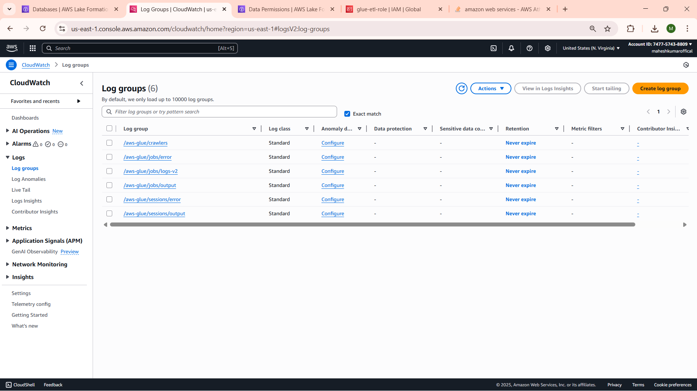

---

## Project Outcomes

- Built a fully functional data lake pipeline from scratch.
- Implemented robust security controls using AWS Lake Formation.
- Enabled querying and visualization of key product metrics.
- Optimized for scalability and cost efficiency using Parquet and partitioning.

---

## ⭐ Author

- Mahesh Kumar S

If you find this repository useful, please ⭐ star it on GitHub!

---
